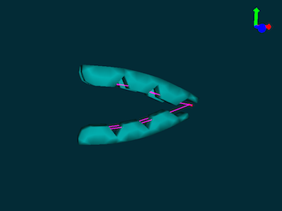

Modeling and simulating a cable based gripper with Sofa-SR
=======================

#### Introduction

This tutorial is about modeling, simulating and fabricating a soft gripper actuated with cable using Sofa-SR. 

Sofa-SR is a modeling, simulation and control environment for Soft-Robotics using Sofa a real-time simulation framework for rigid and deformable mechanics. Sofa-SR is available from https://project.inria.fr/softrobot/

#### Prerequisites
To follow this tutorial you need a working version of Sofa. We provide a Linux disk image with a pre-compiled version of Sofa with all the material for this tutorials. 

Otherwise you need to get sofa & its soft-robotic toolkit plugin:
- Sofa (from http://www.sofa-framework.org)
- Soft-Robotic Toolkit plugin (from https://project.inria.fr/softrobot/)

#### This Tutorials is composed of four parts. 
- Modeling
- Fabrication
- Simulation
- Control

