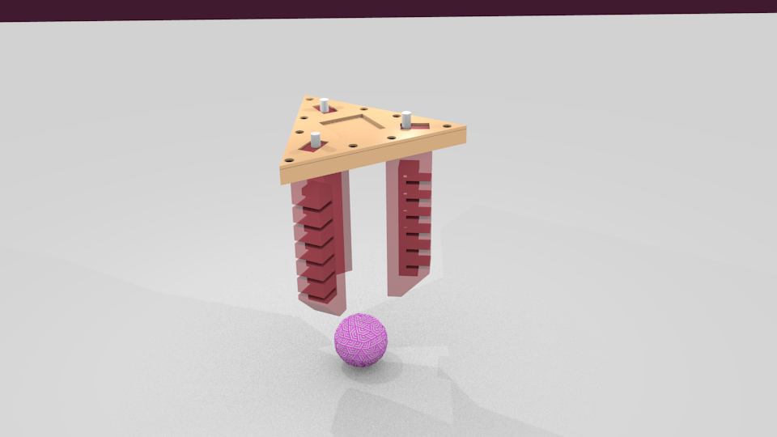

Simulating, Fabricating and Controlling a PneuNets-Gripper
=======================
Contributors: Marwa Eldiwiny, Eulalie Coevoet, Damien Marchal, and Olivier Goury

#### Introduction
This tutorial is about designing, simulating and fabricating a soft gripper made with PneuNets actuators in Sofa-SR. Sofa-SR is a modeling, simulation and control environment for soft robotics using the simulation framework Sofa for rigid and deformable mechanics, and the plugin SoftRobots. PneuNets (pneumatic networks) are a class of soft actuator originally developed by the Whitesides Research Group at Harvard. They are made up of a series of channels and chambers inside an elastomer. These channels inflate when pressurized, creating motion. With three of such actuators it is possible to make a soft gripper. 

For fabrication we wanted to try the new Laser-cutting device available in the FabLab to see if it was easier than our classical 3D-printing workflow. The simulation aspects is done using Sofa-SR which is available from https://project.inria.fr/softrobot/.

This tutorial is strongly inspired from https://softroboticstoolkit.com/book/pneunets-bending-actuator, the biggest difference is on how to use Sofa-SR for modeling and simulation and control. 

#### Prerequisites
To follow this tutorial you need a working version of Sofa-SR. We provide a Linux disk image with a pre-compiled version of Sofa-SR with all the material for this tutorials. 

#### This Tutorials is composed of: 
- [Design](docs/design.md)
- [Simulation](docs/simulation.md)
- [Fabrication](docs/fabrication.md)
- [Control](docs/control.md)
