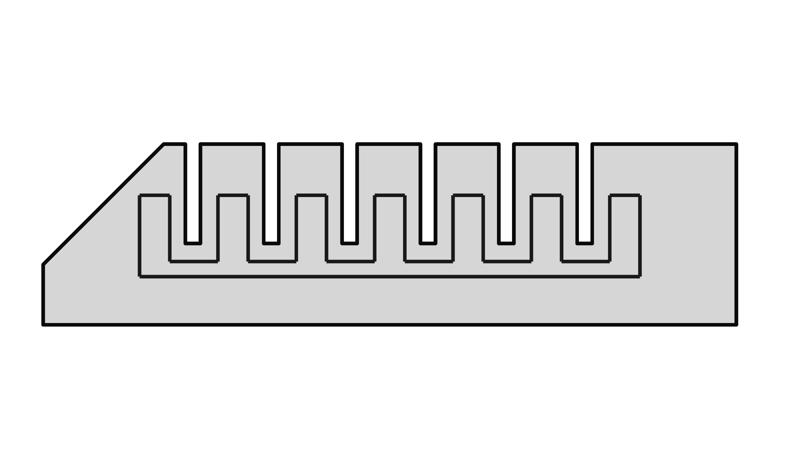
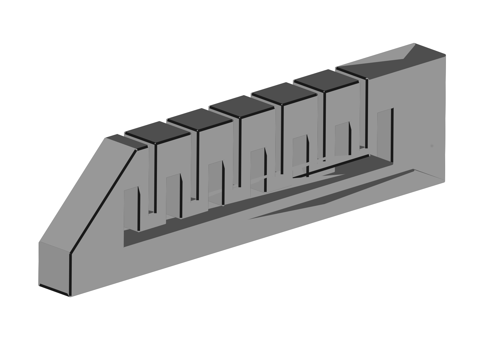

Design
=======================

#### PneuNets Gripper

The gripper is composed of three pneumatic actuators. 

##### PneuNets Actuator

Very detailled description of the PneuNets actuators can be found at the Soft robotics Toolkit pages: https://softroboticstoolkit.com/book/pneunets-bending-actuator. We followed their approach and used FreeCAD to design our own actuator.

        
We provide the FreeCAD project "pneunet.fcstd" in the directory [PneuNets-Gripper/modeling](https://github.com/SofaDefrost/Tutorials/tree/master/PneuNets-Gripper/modeling).

##### Gripper Mounting Platform
TODO: describe a bit the design and add images

