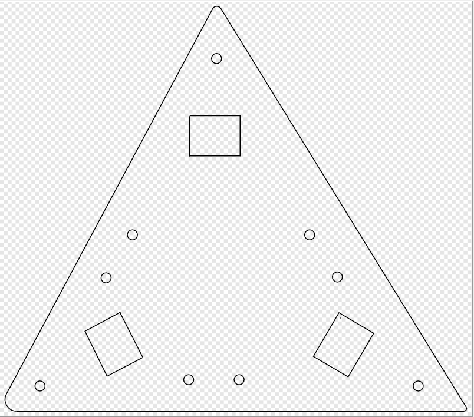

Design
=======================

#### PneuNets Gripper

The gripper is composed of three pneumatic actuators. 

##### 1 PneuNets Actuator

Very detailled description of the PneuNets actuators can be found at the Soft robotics Toolkit pages: https://softroboticstoolkit.com/book/pneunets-bending-actuator. We followed their approach and used FreeCAD to design our own actuator.

        
We provide the FreeCAD project "pneunet.fcstd" in the directory [PneuNets-Gripper/modeling](https://github.com/SofaDefrost/Tutorials/tree/master/PneuNets-Gripper/modeling).

##### 2 Mounting Mechanism
This part handles the design of the mounting mechanism of three PneuNets Actuators, we have to take in consideration the constraints of achieving the desired motion of the actautor. The effective constraints are the dimensions of the head of PneuNets Actuator and its length as well. The idea based on how to make PneuNet actuator which is casted from hot silicon to be mounted with glass material. It is little bit tricky because of both of them have different material properties. The solution is designing a housing for the PneuNet actuator and encapsulating from each side tightly, the mounting mechanism consists of five layers.
The figures belows shows from the bottom the fifth and fourth layer of the holding mechanism, the fourth layer has dimensions 20x30mm for each inlet of PneuNet and the fifth layer has dimensions 20X16mm.

            

The next part of mounting mechanism is ***air distribution***, you can see in the following page of fabrication the technique used for pressuring air. In this part, we provide two solution, the first one is designing vacuum chamber that has three branches feeds the PneuNet inlet; this design could has a problem of air leakage although using silicon surround its edges. The figures below shows the design of vacuum chamber.

            

The other solution for providing the pressurized air is using pneumatic connector, but it also has the bending problem of tubes, but it is a good technique to prevent air leakage. In the following experiment, we are going to fix directly PneuNet. The figure below shows the pneumatic connection. In the following respiratory,  the FreeCAD project is provided "Layers_Design.fcstd" in the directory [PneuNets-Gripper/images](https://github.com/SofaDefrost/Tutorials/tree/master/PneuNets-Gripper/images).

