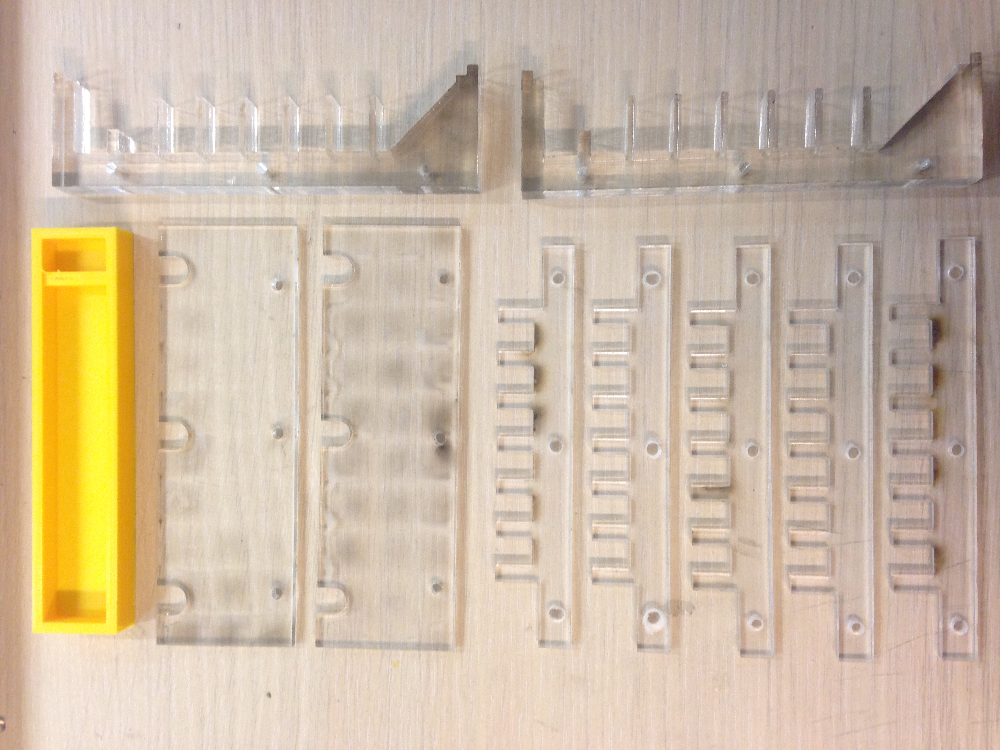
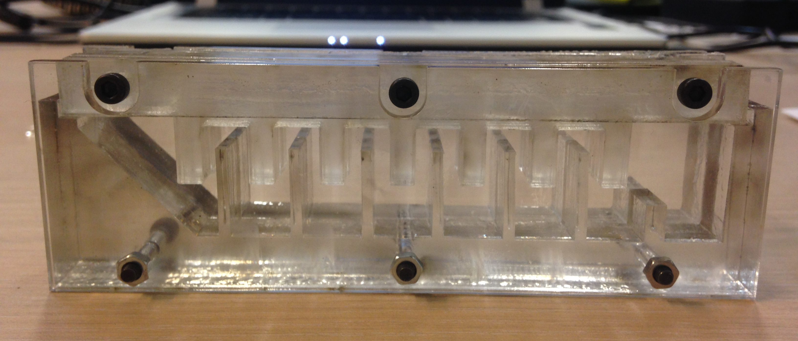

Modeling
=======================

#### PneuNets actuator
Very detailled description of the PneuNets actuators can be found at the Soft robotics Toolkit pages: https://softroboticstoolkit.com/book/pneunets-bending-actuator

We followed their approached but wanted to try the laster cutting system. We used Inkscape to draw the different parts we need. 

The parts are then cutted on Acrylic resulting in the following set of pieces. There is a lot of them because we need to stack several layers of 0.5cm acrylic sheets to match the 2cm of the PneuNet actuators. The laser cutting machine is really fast to produce the resulting pieces:  

Once assembled this looks like:

#### Mounting plateform 
The mounting plateform is holding the three PneuNets actuators on a structure of triangular shape. The structure should also be used to hold the different pipes and air distribution system as well as a way to connect the gripper to a real 3-DOF robotic arm. 

#### Pressuring system & motor plateform.
The pressure system is composed of serhingues actuated by a stepper motor. 
The stepper motor is controlled using an Arduino. 

