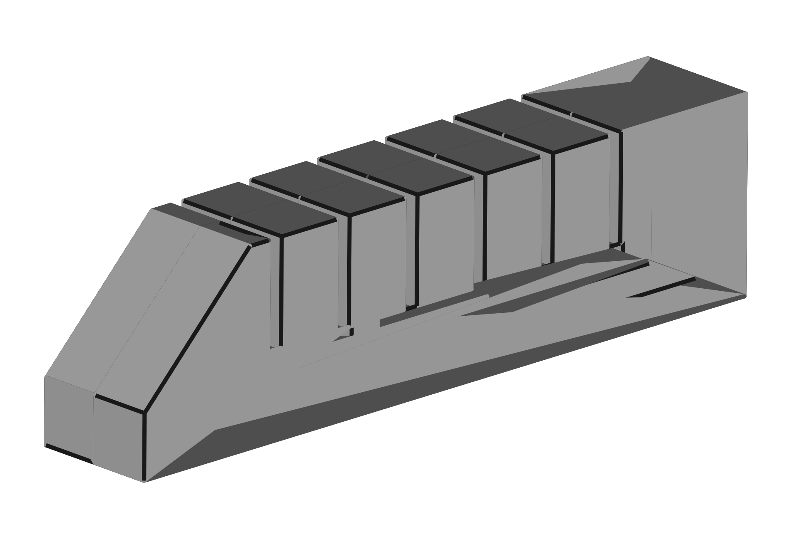

Design
=======================

#### PneuNets Gripper

The gripper is composed of three pneumatic actuators. 

##### 1 PneuNets Actuator

Very detailled description of the PneuNets actuators can be found at the Soft robotics Toolkit pages: https://softroboticstoolkit.com/book/pneunets-bending-actuator. We followed their approach and used FreeCAD to design our own actuator.

        
We provide the FreeCAD project "pneunet.fcstd" in the directory [PneuNets-Gripper/modeling](https://github.com/SofaDefrost/Tutorials/tree/master/PneuNets-Gripper/modeling).

##### Mounting Mechanism
TODO: describe a bit the design and add images

For achieving the function of the three Pneuts, we have to look for robust mounting platform that makes sure the air flows to three pneuts besides holding them.

The Mounting Mechanism of the Pneuts consists of five layer

The first layer

The second layer

The Third Layer

The Fourth Layer

The Fifth Layer

The Airflow

we are going to use the tradition technique

pneumatic connector photo

chamber

The final prototype

For using laser cutting machines

The files for direct printing

