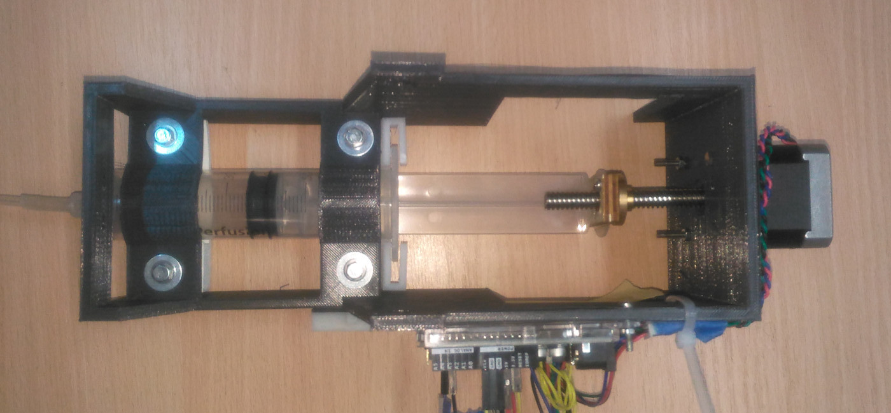

Fabrication
==================

---
### Fabricating the mold to cast the PneuNets actuator
For fabrication of the mold we wanted to try the laser cutting system. The approach is a bit different from what we are used to when working with a 3D printer and we need to decompose the mold into a set of 0.5cm layers that are assembled. 

To make these parts we used Inkscape. The draws are then sent to the laser cutting machine operating on Acrylic sheet of 0.5cm height. Given the heigh of acrylic we needs to assemble several identical shape to match the 2cm height of the PneuNet actuators. Compared to our cheap 3d printing devices the laser cutting machine operates really quickly to produce very good looking parts.  
     

Now the drawback of having a laser cutting is that we have much more work to do to assemble all the parts. But after some assembling we finally got the following result which, because of the transparency of the Acrylic looks really cool.

---

### Silicon casting
We used xx yy silicon...mixed in ...The silicon pour the mold. To rigidify the curving part of the actuator we are using a piece of tissue embedded directly between two layers of silicon.     

 
 
 
 

---  

### Mounting plateform

 
The mounting plateform is holding the three PneuNets actuators on a single structure. The structure should also be used to hold the different pipes and the air distribution system. We also wanted to have the structure to be connected to to a real 3-DOF robotic arm. The structure is done using the laser printing devices from the Inkscape files available at [this location](design.md). The resulting pieces are then assembled. 
 
 
 
 

---

### Pressure system and controller

The pressure system is composed of serhingues actuated by a stepper motor. 
The stepper motor is controlled using an Arduino. The Arduino is connected to a PC using an usb cable and serial emulation. 
The Arduino board then communicate with the Sofa-PR simulation to get the commands. The stepper motor is controlled by the number of step to do.    

 

To link the steps with the air volume a calibration has to be done in which we measure how much steps we can do before touching the serhingue boundaries. In our prototype, 1400 steps are corresponding to 30ml. As the command from Sofa-RT is also in air volume a simple linear relationship implemented on the Arduino board manage the conversion. 

