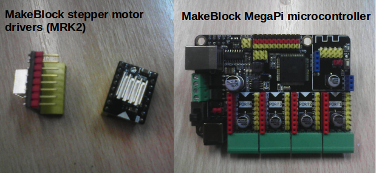
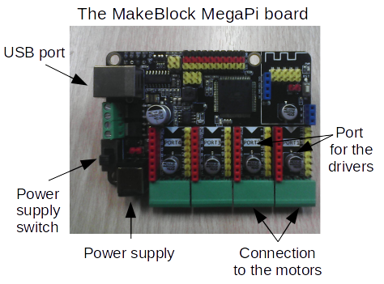
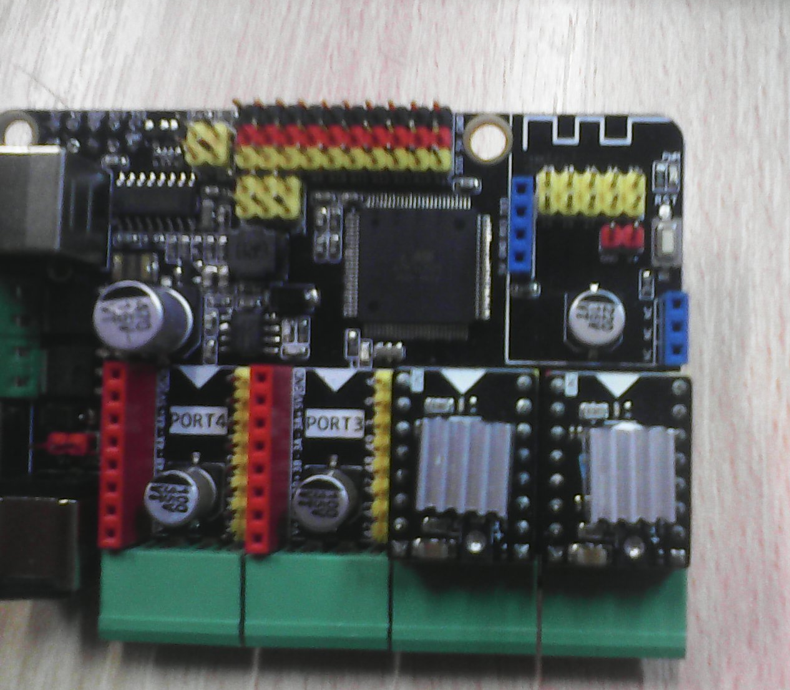
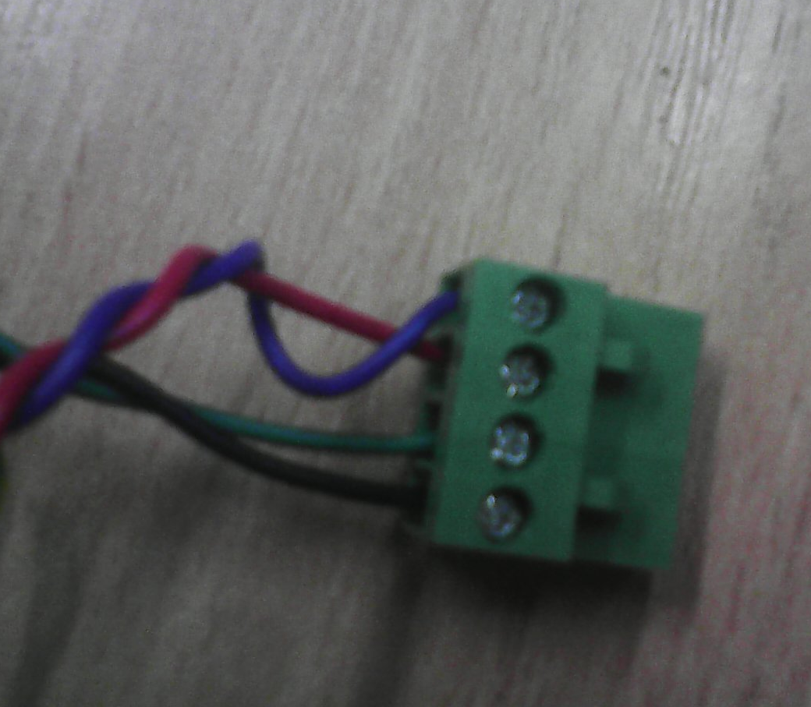
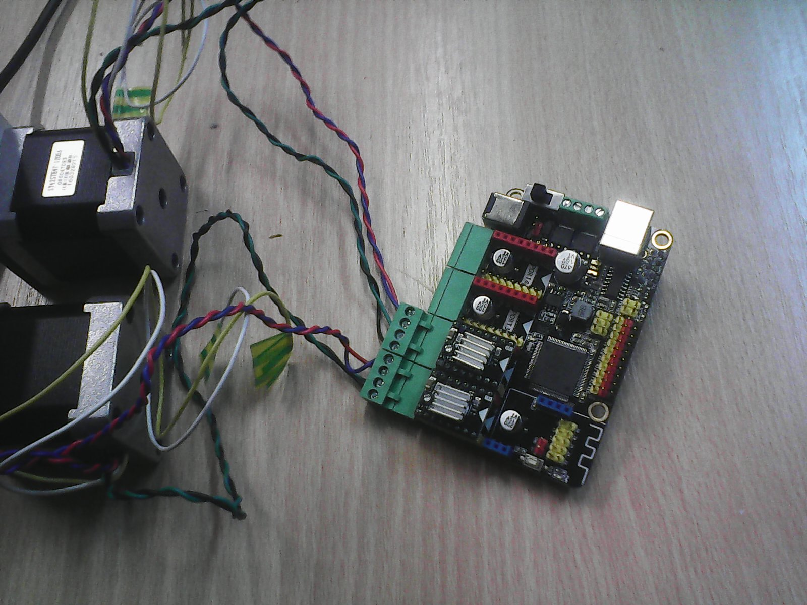
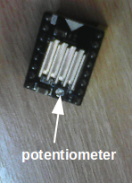
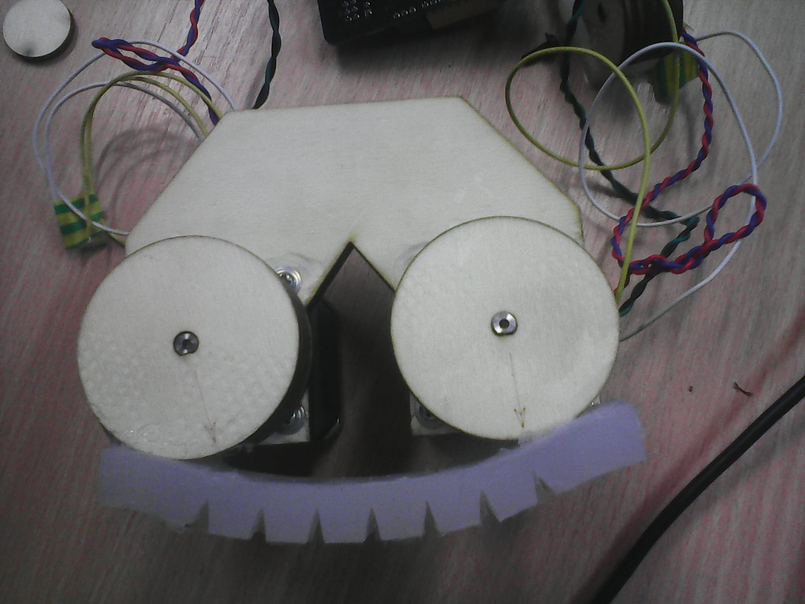

Controlling the W-Gripper
============================
In this part of the tutorial we are going to go through the different steps of the programmation and the control of the motors that actuate the grippers.

### Prerequisites
To follow this part of the tutorial, you will need a few things. First, make sure you have the required material and install the required software before starting.

#### Material
For the controlling part you will need :
 * One MakeBlock MegaPi microcontroller 
 * Two MakeBlock Stepper motor driver V1 model MRK2
 * The gripper prototype done following the fabrication part of this tutorial.
 * A multimeter
 * A 9V power supply with jack adapter
 * A small phillips screwdriver  
 



#### Software
Before begining the program you will need to install on your computer :
 *  Arduino software [(available here)](https://www.arduino.cc/en/Main/Software)
 *  MakeBlock-USB-Driver [(available here)](https://github.com/Makeblock-official/Makeblock-USB-Driver)
 *  MakeBlock-Libraries [(available here)](https://github.com/Makeblock-official/Makeblock-Libraries) _make sure to include the librairies in the Arduino's librairies folder in order to use it._
 * TimerOne librairie [(available here)](https://playground.arduino.cc/Code/Timer1) _make sure to include the librairies in the Arduino's librairies folder in order to use it._

### Preparation
Before starting the code and the control we have to cable and to connect the drivers, the robot and all the wires to the board and the computer. This is a description of the board and the differents parts we are going to use.



  
  <br><br><br>
First take your MegaPi board and the two Stepper drivers. Plug the divers on the port 1 and 2 of the board, such as shown on the picture aside. 
<br><br>
  
  
Then take the gripper and connect the motors cables to the plugs and plug them on the board. Make sure the cables are in the right order : if you are using the same motors as described in the fabrication part, the order shall be black (A+), green (A-), red (B-), blue (B+). You can check on the back of the board the pin name and assure your connections are correct.  
<br>
You shall make sure that if you're looking to the robot and the pulley are facing you, the motor on your right is plugged to port 1 and the left one is plugged to port 2. If they are not plugged correctly they will be turning the wrong way.

  


<br><br>
  
The Makeblock board has an external alimentation for the motor. In order to power the motor you shall connect it with a 9V power supply. The switch just aside control the turning on. Make sure you don't turn it on unless you want to. 
With a multimeter, you can adjust the voltage send to the motor by adjusting the position of the potentiometer on the driver. We fixed the output voltage at 4V.
<br><br><br>

The gripper is ready, next step is the control. Let's now have a look at the programmation.
<br><br><br>


### Programmation
The programmation of the gripper's control is going to be done using Arduino IDE and using the MakeBlock libraries. Those choices have been made beaucause of the ease of use of the materials and the libraries. _If you have never used Arduino IDE before you can have a look here : [first step with Arduino IDE ](http://www.arduino.org/learning/getting-started/first-steps-with-arduino-ide)._
In order to use the Makeblock and TimerOne libraires you have to make sure you've included it in your Arduino's librairies files, and tha you've included the file by writing this line in the top of your program :
```C++
#include "MeMegaPi.h"
#include "TimerOne.h"
```
If you want to have a first look on the control of stepper motors using the MekeBlock librairie, you can have a look at the example  _MegaPiOnBoardStepperTest_. Anyway, we will see each function we will be using from this librairie one by one.  
First of all you have to declare each motor we want to control. In this tutorial, we are going to use 2 steppers motors and we have put them on the port 1 and 2. We declare them in a table of MeStepperOnBoard (type imported from the MakeBlock library). This is the declaration:

```C++
MeStepperOnBoard stepper[2] {{SLOT_1},{SLOT_2}}; 
```
This declaration handles all the pin declaration that you may do if you were using a simple Arduino board. It makes it easier because we can abstract from all the materials' connections of the pin.
  
The MakeBlock board works the same way as an Arduino. This mean that we have to define the two main functions of arudino _setup_ and _loop_. The setup function will handle all the code that will be done once when the programm starts. The loop will be called reapeatedly and executed as long as the board is connected.

In order to use the motors we must initialize them. For each motor, we can define its MaxSpeed, its acceleration, and its number of microsteps. As we want the two motors to have the same behaviour, we shall fix the same parameters for both of them. We put this code in a function so we can call it in the Arduino setup function.

```C++  
void StepperInit(){
    for(int i =0;i<2;i++){
      stepper[i].setMaxSpeed(100);
      stepper[i].setAcceleration(20000);
      stepper[i].setMicroStep(16);
      stepper[i].enableOutputs();// TODO tell what this function do or see if it's usefull
    }
}
```

To handle the motor's rotation the library provides us two functions :
  * __stepper.move(_int_ number-of-micro-steps)__
  * __stepper.moveTo(_int_ position)__  
  
Thoose functions will store the desired position to make the rotation ; you must call the function __stepper.run()__. Each time it is called, the motor will make one microstep towards the desired position.

As we are currently handling two motors and we want them to synchronize and rotate in opposite directions we can define several functions that will handle it :

```C++
void StepperMoveTo(int value)
{
    stepper[0].moveTo(-value);
    stepper[1].moveTo(value);   
}
void StepperMove(int value)
{
    stepper[0].move(-value);
    stepper[1].move(value);   
}

void StepperRun()
{
    stepper[0].run();
    stepper[1].run();   
}
```
As we want the motor to run repeatedly we can for now put it in the loop function. Our main Arduino's functions actually look like this:
```C++
void setup()
{
   StepperInit();
}

void loop()
{
   StepperRun();
}
```
Actually, the problem is that we want to be able to control the rotation of the motors and to send the wanted position to the Arduino board so that he commands the motors to move so. In order to communicate with the Arduino, we will use Serial communication ([for more information see Serial] (https://www.arduino.cc/en/Reference/Serial). Serial communication must be initialized by setting the frequency of the communication by using __Serial.begin(_int_ frequency)__. So we will put this line of code in the setup function.

```C++
   Serial.begin(9600);
```
In the Arduino IDE you can open a serial communication by clicking on the magnifying glass icone. You must be connected to the board before doing this.

<!-- __TODO tell what is the board's name with a computer that has the USB driver installed on and how to connect to it__-->

To catch the sent values, you may use several Serial functions:
 * __Serial.available()__ returns a boolean that tell us whether data have been received (true) or not (false).
 * __Serial.parseInt()__ reads the available data, parse it as an integer if possible and returns it or returns 0 if the piece of data isn't an integer. With this code we can catch the value and pass it to the function __StepperMove()__ or __StepperMoveTo()__.

```C++
 long value;
  if(Serial.available()>1)
  {
    value = Serial.parseInt();
    Serial.print("value : ");
    Serial.println(value);
  }
  StepperMoveTo(value);
```
Now our first code version looks like this and we can handle a first control of the position:

```C++
#include "TimerOne.h"
#include "MeMegaPi.h"

MeStepperOnBoard stepper[2] {{SLOT_1},{SLOT_2}}; 

void StepperMoveTo(int value)
{
    stepper[0].moveTo(-value);
    stepper[1].moveTo(value);   
}
void StepperMove(int value)
{
    stepper[0].move(-value);
    stepper[1].move(value);   
}

void StepperRun()
{
    stepper[0].run();
    stepper[1].run();   
}

void StepperInit()
{
   for(int i =0;i<2;i++)
    {
      // Change these to suit your stepper if you want
      stepper[i].setMaxSpeed(100);
      stepper[i].setAcceleration(20000);
      stepper[i].setMicroStep(16);
      stepper[i].enableOutputs();
  
    }
}

void setup()
{ 
    Serial.begin(9600); 
    StepperInit();
}

void loop()
{
  long value;
  if(Serial.available()>1)
  {
    value = Serial.parseInt();
    StepperMoveTo(value);
  }
  StepperRun();
}
```
In order to improve the behaviour, we are going to separate the rotation of the motor from the serial reading and converting values. Indeed, we want the motors to turn on regular steps whether we get new values on the serial or not. As this operation takes time, we can use the Arduino's timer to separate the motor's steps from the rest of the code.  
We have already imported and installed the TimerOne librairie. It defines an unique object Timer1 that interupts the execution of the code. We will only use 2 functions to separate the actions :
 * __Timer1.initialize( _int_ time)__ that defines the delay between two interruptions.
 * __Timer1.attachInterrupt(_function_ function)__ which attaches the function that will be called at each interruption.
 
We already have the function we want to attach : __StepperRun()__. We just have to initialize the Timer1 with a reasonable period (if the period is too long, then it will be worst than before and the motor will turn very slowly; if it's too short the program will never enter the loop and will lock up). Actually we picked up 100 ms. So we just have to remove the StepperRun() call from the loop and add those lines to the setup :
```C++
  Timer1.initialize(100);
  Timer1.attachInterrupt(StepperRun);
```
  
And then that's it, we've separated the rotation of the motor - which is now periodical - from the communication with the Arduino. So here is our final version of the code:
```C++
#include "TimerOne.h"
#include "MeMegaPi.h"

MeStepperOnBoard stepper[2] {{SLOT_1},{SLOT_2}}; 

void StepperMoveTo(int value)
{
    stepper[0].moveTo(-value);
    stepper[1].moveTo(value);   
}
void StepperMove(int value)
{
    stepper[0].move(-value);
    stepper[1].move(value);   
}

void StepperRun()
{
  stepper[0].run();
  stepper[1].run();   
}

void StepperInit()
{
  for(int i =0;i<2;i++)
    {
      // Change these to suit your stepper if you want
      stepper[i].setMaxSpeed(100);
      stepper[i].setAcceleration(20000);
      stepper[i].setMicroStep(16);
      stepper[i].enableOutputs();
  
    }
}

void setup()
{ 
  Serial.begin(9600); 
  StepperInit();
  Timer1.initialize(100);
  Timer1.attachInterrupt(StepperRun);
}

void loop()
{
  long value;
  if(Serial.available()>1)
  {
    value = Serial.parseInt();
    StepperMoveTo(value);
  }
}
```
    
Actually, next step would be to make SOFA and the Arduino communicate directly with each other so we won't have to enter manually the desired rotation, but for now this communication has not been implemented yet.
