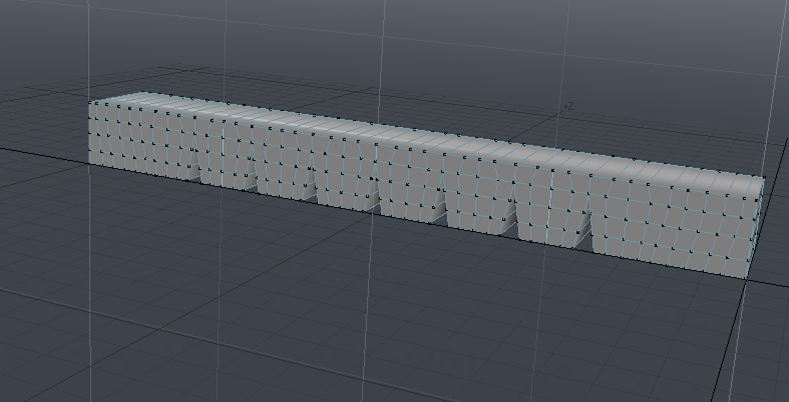
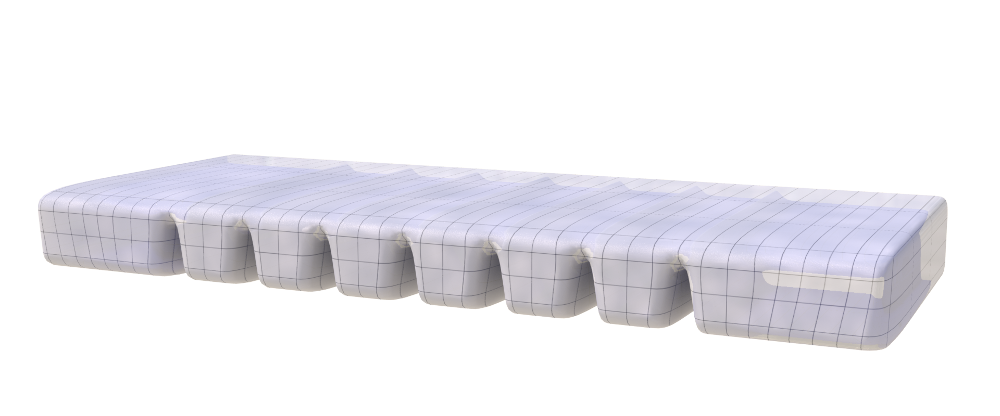
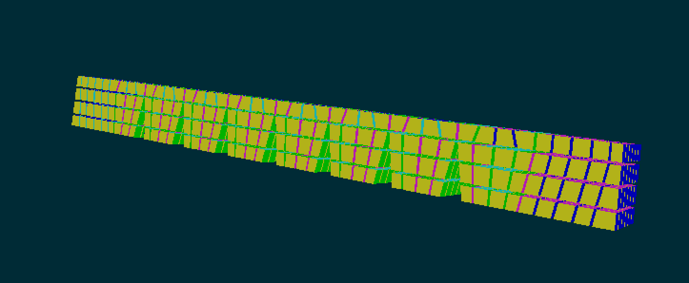

# Modeling

## Basic Concept

## 3D Model

Since the geometry of the gripper is simple, modeling the gripper in any of CAD / Modeling software is quite straight-forward: first you have to design a planar shape and then to extrude it along the Y-axis. Even if it is possible to mesh it with triangles, we recommend to use quads because it will enable to automatically build hexahedra for the FEM simulation.

## Volumetric Mesh 

Starting from the 3D model (surface mesh), it is mandatory to compute volume elements for the FEM simulation. Standard volume elements are tetrahedral elements or hexahedral elements. SOFA provides some tools to ease the creation of the volumetric mesh given a surface model.

### with Tetrahedra

### with Hexahedra

Hexahedral elements have better mechanical properties for simulation: it is more stable and requires less elements making it suitable for interactive simulation. Building hexaedral volumes can be a tedious task given the geometry we want to mesh. For the W-Gripper, the simple geometry (a planar mesh extruded along the Y-axis) enables to compute hexaedra. For that we will rely on a SOFA component called `ExtrudeQuadsAndGenerateHexas`. There are two important parameters for this component: `thicknessOut` (how depth will be the extrusion) and `numberOfSlices` (how many slices will be build along the extrusion axis). Once this is done, additional components are added to create a topology from this hexahedra (`HexahedronSetTopologyContainer`, `HexahedronSetTopologyModifier`, `HexahedronSetTopologyAlgorithms`, `HexahedronSetGeometryAlgorithms`) and a dedicated FEM forcefield is needed (`HexahedronFEMForceField`). Adding other components to make the simulation leads to the following scene:

~~~
import Sofa
import os

TODO
~~~

