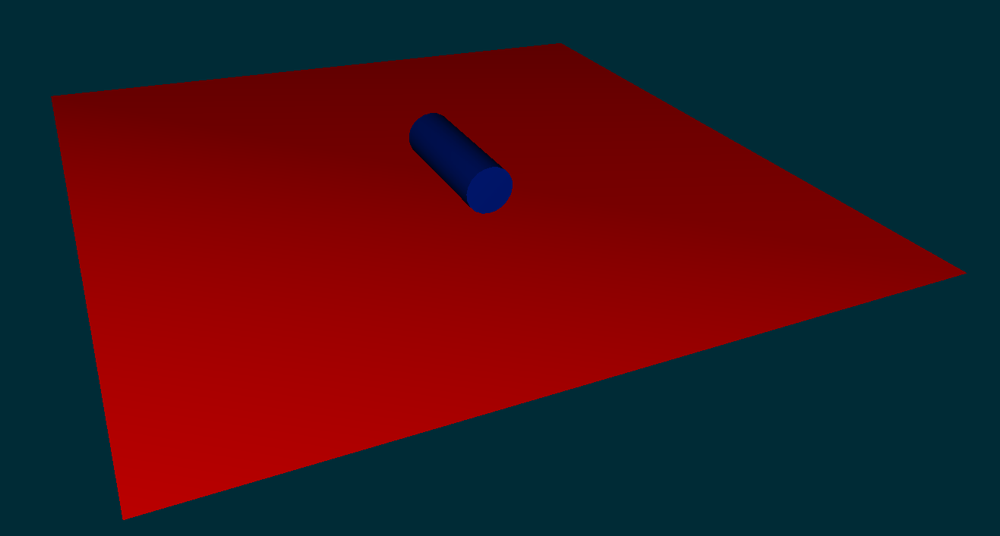

# Step 1 : Environment

As a first step, we need to define the simulation environment. What we need is a flat floor and an object which will be grasped by our gripper.



Let's create our floor function:
```python
        ################################ Fix Floor ################################
  def createFloor(node):
        floorNode = node.createChild('Floor') ## create a new graphe node dedicated to the floor
        floorNode.createObject('MeshObjLoader', name='loader', filename="mesh/floorFlat.obj", rotation="0 0 270", scale =5, translation="30 0 0") ## 
        floorNode.createObject('Mesh', src="@loader")
        floorNode.createObject('MechanicalObject', src="@loader")
        floorNode.createObject('Triangle',simulated="0", moving="0")
        floorNode.createObject('Line',simulated="0", moving="0")
        floorNode.createObject('Point',simulated="0", moving="0")
        floorNode.createObject('OglModel',name="Visual", fileMesh="mesh/floorFlat.obj", color="1 0 0 1",rotation="0 0 270", scale =5, translation="30 0 0")
        return floorNode
```
And add it to the createScene function : 

```python
        floorNode = createFloor(rootNode)
```

```python
################################ Grasped Object ###################################
def createGraspedObject(node):
        # mechanics
        graspedNode =node.createChild('graspedNode')
        graspedNode.createObject('EulerImplicit', name='odesolver')
        graspedNode.createObject('CGLinearSolver', name='graspedNodeSolver', iterations='25', tolerance='1e-05', threshold='1e-05')
        graspedNode.createObject('MechanicalObject', template="Rigid", scale="1", position='38 0 0 0 0 0 1')

        Ix= mass/12.0*(3.0*R*R + h*h)
        Iy= mass/12.0*(3.0*R*R + h*h)
        Iz= mass*R*R/2.0

        graspedNode.createObject('UniformMass', mass='0.01'+str(volume)+' ' +str(Ix)+ ' 0 0 0 '+str(Ix)+' 0 0 0 '+str(Iz))
        graspedNode.createObject('UncoupledConstraintCorrection')

        #collision
        graspedNodeCollis = graspedNode.createChild('graspedNodeCollis')
        graspedNodeCollis.findData('activated').value=1
        graspedNodeCollis.createObject('MeshObjLoader', name="loader", filename="mesh/cylinder_JD.obj", triangulate="true",  scale3d="300 300 2000", translation="0 0 -20")
        graspedNodeCollis.createObject('Mesh', src="@loader")
        graspedNodeCollis.createObject('MechanicalObject')
        graspedNodeCollis.createObject('Triangle')
        graspedNodeCollis.createObject('Line')
        graspedNodeCollis.createObject('Point')
        graspedNodeCollis.createObject('RigidMapping')

        #graspedNodeCollis.createObject('LocalMinDistance', name="Proximity",alarmDistance="4", contactDistance="3", angleCone="0.01")

        #visualization
        graspedNodeVisu = graspedNode.createChild('graspedNodeVisu')
        graspedNodeVisu.createObject('OglModel', name="Visual", fileMesh="mesh/cylinder_JD.obj", color="0.0 0.1 0.5", scale3d="300 300 2000" , translation="0 0 -20")
        graspedNodeVisu.createObject('RigidMapping')
        return graspedNode
```

And add it to the createScene function : 

```python
        graspedObjectNode = createGraspedObject(rootNode)
```
