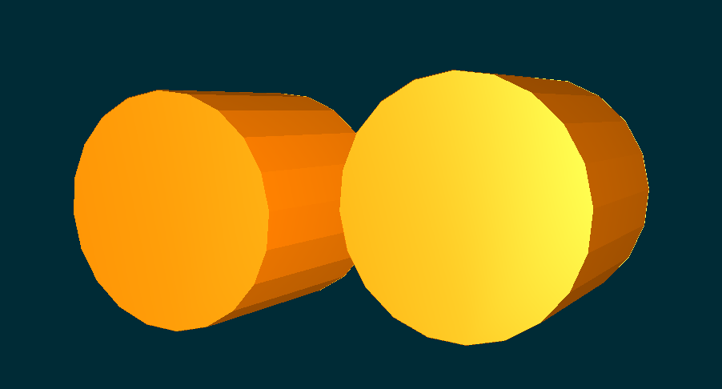

# Step 2 : Rollers

As we described our gripper in the modeling section, the purpose of this soft robot is to grasp object by using a rubber band. This rubber band will be stretched or compressed by two rollers controlled by motors. We will now create and add those rollers in the simulation. First step, create the mechanical objects and secondly control them using a python script.

Here is a preview of the rollers in the simulation : 


```python
        
################################ cylinderline Object ###################################
def createCylinder(name, node, x, y, z, vx, vy, vz):

        # mechanics
        cylinder = node.createChild(name)
        cylinder.createObject('EulerImplicit', name='odesolver')
        cylinder.createObject('CGLinearSolver', name=name+'Solver', iterations='1000', tolerance="1e-5", threshold="1e-5")
        cylinder.createObject('MechanicalObject', name=name+"cylinderMO", template="Rigid", scale="5", dx=x, dy=y, dz=z, rx=vx ,ry=vy, rz=vz, velocity='0 0 0 0 0 0')
        cylinder.createObject('UniformMass', totalMass='0.030')
        cylinder.createObject('UncoupledConstraintCorrection')
        cylinder.createObject('FixedConstraint', fixAll='1')

        #collision
        cylinderCollis = cylinder.createChild(name+'Collis')
        cylinderCollis.createObject('MeshObjLoader', name="loader", filename="mesh/cylinder_JD.obj", triangulate="true",  scale3d="1000 1000 2000", translation="0 0 -30")
        cylinderCollis.createObject('Mesh', src="@loader")
        cylinderCollis.createObject('MechanicalObject', rx=90)
        cylinderCollis.createObject('Triangle', group='2')
        cylinderCollis.createObject('RigidMapping')

        #visualization
        cylinderVisu = cylinder.createChild(name + 'Visual')
        cylinderVisu.createObject('OglModel', name="Visual", fileMesh="mesh/cylinder_JD.obj", color="0.0 0.1 0.5", scale="10")
        cylinderVisu.createObject('RigidMapping')
        return cylinder
```


Continue go to step 3 : [FEM W Mesh](simulationFEMWMesh.md) 
